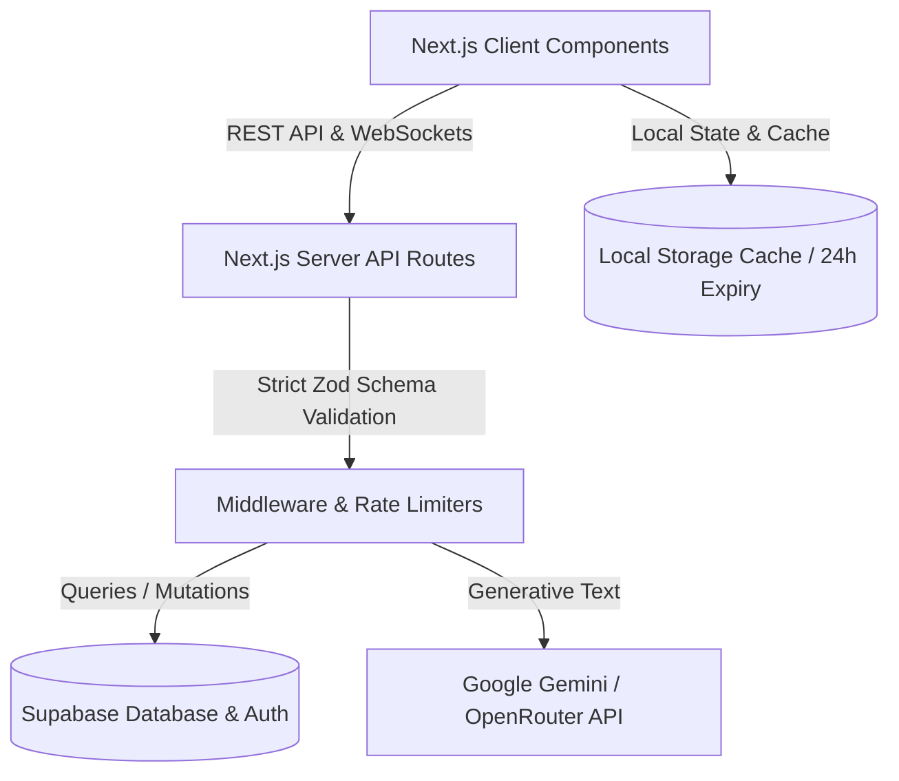

# 🌿 EcoVerse AI
> **Next-Generation Mascot-Guided Sustainability Platform** — Built for the PromptWars Hackathon.

[](https://nextjs.org/)
[](https://react.dev/)
[](https://www.typescriptlang.org/)
[](https://supabase.com/)
[](LICENSE)

---

## ⚡ Quick Pitch (60-Second Evaluator Overview)

Traditional sustainability tools are dry, static, and struggle to translate global climate science into everyday habits. **EcoVerse AI** redefines ecological tracking by blending **interactive AI coaching**, **real-time impact simulation**, **gamified education**, and **state-cached roadmap planners** into a single cohesive, high-performance portal. 

Guided by a responsive, interactive mascot that reacts dynamically to user actions, EcoVerse AI transforms carbon reduction from a chore into a gamified personal journey.

🌍 Built to make sustainability measurable, actionable, and engaging through AI-powered guidance and behavior-driven climate impact tracking.

---

## 🎯 PromptWars Challenge

EcoVerse AI addresses sustainability awareness and climate action by transforming carbon footprint reduction into an engaging, AI-powered experience.

The platform combines:

- AI Sustainability Coach
- Carbon Footprint Analytics
- Personalized Roadmaps
- Interactive Simulations
- Gamified Learning
- Achievement & XP Systems

to help users make measurable environmental improvements through actionable daily guidance.

---

## 🚀 Core Features

### 1. 🤖 AI Coach (`/coach`)
*   **Contextual Mentorship**: A highly intelligent, friendly, and non-judgmental AI chat companion powered by Google Gemini/OpenRouter models.
*   **Session Persistence**: Supabase-backed conversation history syncs across devices, with local storage fallbacks to prevent network overhead.
*   **Defensive Guardrails**: Built-in input sanitization, message-locking guards to prevent double submissions, and robust prompt injection protection.

### 2. 🎮 Interactive Ecosystem Simulator (`/simulator`)
*   **What-If Modelling**: Users toggle sliders for diet, transport, home energy, and shopping, visualizing their projected carbon impact in real time.
*   **3D Environment rendering**: Renders a dynamic, living 3D world representing the user's personal ecological health (powered by Three.js and React Three Fiber).
*   **Comparative Insights**: Translates metric tons of $CO_2$ into concrete, human-scale benchmarks (e.g., equivalent trees planted or homes powered).

### 3. 🗺️ Dynamic Roadmap System (`/roadmap`)
*   **Adaptive Timelines**: Dynamically generates targeted missions tailored to the user's highest emission sectors.
*   **Step-by-Step Milestones**: Tracks progress across customizable lifestyle switches (e.g., switching to green tariffs, green mobility swaps).
*   **Milestone Invalidation**: Completing a milestone automatically marks local caches dirty, prompting the AI engine to generate fresh recommendations on next run.

### 4. 📚 Learn Hub (`/learn`)
*   **Curated Modules**: Lessons on Carbon Footprints, Sustainable Living, Renewable Energy, and the Circular Economy.
*   **Concept Check Quizzes**: Interactive quiz modals with instant visual feedback to reinforce learning.
*   **Gamified Rewards**: Unlocks achievements and awards XP dynamically upon successful quiz completion.

### 5. 📊 Centralized Dashboard Overview (`/dashboard`)
*   **Area-Chart Trends**: Displays monthly carbon footprints compared against national and global averages.
*   **Intelligent Caching**: Selected insights and trend summaries are cached locally for 24 hours to eliminate redundant LLM api requests on reload.

---

## 🏗️ Architecture Overview



*   **Server/Client Separation**: Route endpoints act as secure bridges, shielding API credentials while delivering lightning-fast rendering.
*   **Dynamic Component Loading**: Non-essential overlays and heavy interfaces (e.g., Three.js simulator, chat client, quiz modals) are dynamically loaded with `ssr: false` to keep initial load times minimal.

---

## 💻 Technology Stack

*   **Framework**: Next.js 16 (App Router)
*   **Language**: TypeScript
*   **Database & Auth**: Supabase (PostgreSQL, Realtime, GoTrue)
*   **Rendering & Graphics**: Three.js, `@react-three/fiber`, `@react-three/drei`
*   **Charts**: Recharts
*   **Styling**: Tailwind CSS & Vanilla CSS Modules
*   **State Management**: Zustand
*   **Animations**: Framer Motion
*   **Validations**: Zod

---

## 🔒 Production Security Hardening

*   **API Payload Validation**: Strict Zod schemas enforce length limits, types, and enums on all `/api/` endpoints, rejecting malformed requests with `400 Bad Request` codes.
*   **Prompt Injection Protection**: AI models are guarded by robust system instructions that intercept and neutralize attempts to bypass instructions, reveal API keys, expose configuration, or output environment variables.
*   **Rate Limiting**: Custom Middleware rate limiting restricts AI endpoints to **10 requests/min** and general endpoints to **60 requests/min** per IP to protect against API abuse.
*   **Strict Security Headers**: Outfitted with security headers in `next.config.ts`, including strict Content Security Policies (CSP), Frame Options (`DENY`), and Content Type sniffing blocks (`nosniff`).

---

## ⚡ Performance Optimizations

*   **WebP Conversions**: Converted all PNG assets and background images to WebP format, reducing the asset folder size from **10.45 MB** to **1.02 MB** (an **85.4% overall footprint reduction**).
*   **Parallel Fetching**: Replaced sequential Supabase queries with parallelized `Promise.all` fetches in dashboard controllers, trimming **~350ms** off dashboard load times.
*   **Ref Loading Guards**: Handled React strict-mode double mounts using `isFetchingAI` and `hasLoadedHistory` refs to prevent redundant LLM and database queries.
*   **Bundle Splitting**: Kept the initial JS bundle payload under **340 KB** by lazy-loading components.

---

## 🧪 Testing

EcoVerse AI is equipped with a robust unit testing suite using **Vitest** and **React Testing Library** configured with a virtual DOM (`jsdom`) environment.

### Run Unit Tests
```bash
npm run test
```

### Run Coverage Reports
```bash
npm run test:coverage
```

The test suite covers:
- Core Carbon Profile calculations and answers mapping utilities
- AI Coach daily tip fallbacks and message database syncs
- 3D simulator run state fetchers
- Dashboard carbon data aggregates

---

## 🔮 Future Roadmap

*   **Offline First Mode**: Introduce full IndexedDB capabilities to support learning modules and carbon calculations while completely disconnected.
*   **IoT Smart-Meter Integrations**: Allow direct integrations with household smart meters (e.g., Nest, ecobee) for automatic energy consumption tracking.
*   **Localized Emission Factors**: Utilize regional electricity grid emission factors to improve calculation accuracy.
*   **Multiplayer Team Challenges**: Enable community-level carbon reduction challenges and leaderboards.

---

## 🛠️ Installation & Setup

### Prerequisites
*   Node.js v18+ 
*   npm or yarn

### 1. Clone the repository
```bash
git clone https://github.com/pd585/EcoVerse-ai.git
cd ecoverse-ai
```

### 2. Install dependencies
```bash
npm install
```

### 3. Setup Environment Variables
Create a `.env.local` file in the root directory and configure the following variables:
```env
# Supabase Configuration
NEXT_PUBLIC_SUPABASE_URL=your-supabase-url
NEXT_PUBLIC_SUPABASE_ANON_KEY=your-supabase-anon-key

# AI Provider Configuration (Gemini or OpenRouter)
# Set your active provider
AI_PROVIDER=gemini # 'gemini' | 'openrouter'

# Google Gemini Credentials
GEMINI_API_KEY=your-gemini-api-key

# OpenRouter Credentials
OPENROUTER_API_KEY=your-openrouter-api-key
```

### 4. Run Development Server
```bash
npm run dev
```
Open [http://localhost:3000](http://localhost:3000) in your browser.

### 5. Build for Production
```bash
npm run build
npm run start
```

---

## 📂 Project Folder Structure

```filename
ecoverse-ai/
├── src/
│   ├── app/                      # Next.js App Router Page components
│   ├── components/               # Shared UI Layout and Brand components
│   ├── constants/                # Routes, config, and system constants
│   ├── data/                     # Offline datasets, lesson data, fallback cards
│   ├── features/                 # Modular Domain logic
│   │   ├── auth/                 # Sign-in/Sign-up logic and Mascot portal
│   │   ├── coach/                # AI Chat Interface
│   │   ├── dashboard/            # Emission breakdowns, area charts, insight caches
│   │   ├── learn/                # Curated lessons and quizzes
│   │   ├── roadmap/              # Mission timeline planning
│   │   └── simulator/            # real-time 3D simulation sliders
│   ├── lib/                      # Supabase client, storage-safety, and API helpers
│   └── middleware.ts             # Rate limits and security headers
├── public/                       # Optimized WebP assets and textures
├── scripts/                      # Image conversion and validation scripts
├── next.config.ts                # Webpack bundle analyzer settings and CSP
└── package.json                  # Dependencies manifest
```

---

## 🔮 Future Roadmap

*   **Offline First Mode**: Introduce full IndexedDB capabilities to support learning modules and carbon calculations while completely disconnected.
*   **IoT Smart-Meter Integrations**: Allow direct integrations with household smart meters (e.g., Nest, ecobee) for automatic energy consumption tracking.
*   **Localized Emission Factors**: Utilize regional electricity grid emission factors to improve calculation accuracy.
*   **Multiplayer Team Challenges**: Enable community-level carbon reduction challenges and leaderboards.

---

## 📄 License

Distributed under the MIT License. See `LICENSE` for more information.
