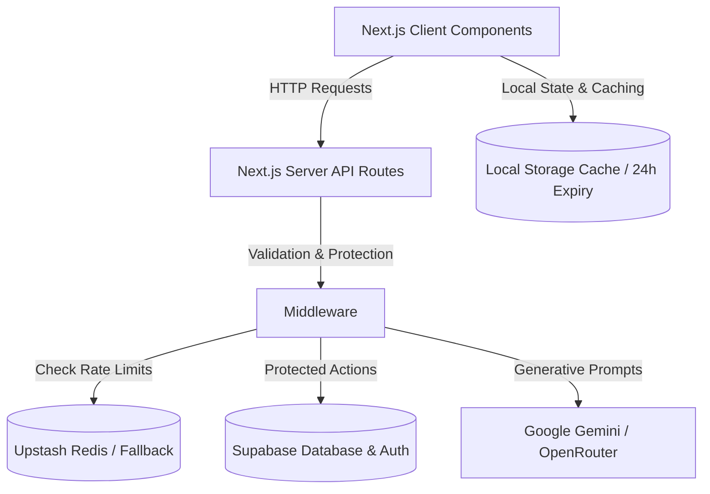

# 🌿 EcoVerse AI
> **Next-Generation Mascot-Guided Sustainability Platform** — Built for the PromptWars Hackathon.

[](https://nextjs.org/)
[](https://react.dev/)
[](https://www.typescriptlang.org/)
[](https://supabase.com/)
[](https://upstash.com/)
[](https://playwright.dev/)
[](LICENSE)

---

## ⚡ Quick Pitch (60-Second Evaluator Overview)

Traditional sustainability tools are dry, static, and struggle to translate global climate science into everyday habits. **EcoVerse AI** redefines ecological tracking by blending **interactive AI coaching**, **real-time impact simulation**, **gamified education**, and **state-cached roadmap planners** into a single cohesive, high-performance portal. 

Guided by a responsive, interactive mascot that reacts dynamically to user actions, EcoVerse AI transforms carbon reduction from a chore into a gamified personal journey.

🌍 Built to make sustainability measurable, actionable, and engaging through AI-powered guidance and behavior-driven climate impact tracking.

---

## 🎯 PromptWars Challenge

EcoVerse AI addresses sustainability awareness and climate action by transforming carbon footprint reduction into an engaging, AI-powered experience.

The platform combines:
- AI Sustainability Coach
- Carbon Footprint Analytics
- Personalized Roadmaps
- Interactive Simulations
- Gamified Learning
- Achievement & XP Systems

to help users make measurable environmental improvements through actionable daily guidance.

---

## 🚀 Core Features

### 1. 🤖 AI Coach (`/coach`)
*   **Contextual Mentorship**: A highly intelligent, friendly, and non-judgmental AI chat companion powered by Google Gemini/OpenRouter models.
*   **Session Persistence**: Supabase-backed conversation history syncs across devices, with local storage fallbacks to prevent network overhead.
*   **Defensive Guardrails**: Built-in input sanitization, message-locking guards to prevent double submissions, and robust prompt injection protection.

### 2. 🎮 Interactive Ecosystem Simulator (`/simulator`)
*   **What-If Modeling**: Users toggle sliders for diet, transport, home energy, and shopping, visualizing their projected carbon impact in real time.
*   **3D Environment Rendering**: Renders a dynamic, living 3D world representing the user's personal ecological health (powered by Three.js and React Three Fiber).
*   **Comparative Insights**: Translates metric tons of $CO_2$ into concrete, human-scale benchmarks (e.g., equivalent trees planted or homes powered).

### 3. 🗺️ Dynamic Roadmap System (`/roadmap`)
*   **Adaptive Timelines**: Dynamically generates targeted missions tailored to the user's highest emission sectors.
*   **Step-by-Step Milestones**: Tracks progress across customizable lifestyle switches (e.g., switching to green tariffs, green mobility swaps).
*   **Milestone Invalidation**: Completing a milestone automatically marks local caches dirty, prompting the AI engine to generate fresh recommendations on next run.

### 4. 📚 Learn Hub (`/learn`)
*   **Curated Modules**: Lessons on Carbon Footprints, Sustainable Living, Renewable Energy, and the Circular Economy.
*   **Concept Check Quizzes**: Interactive quiz modals with instant visual feedback to reinforce learning.
*   **Gamified Rewards**: Unlocks achievements and awards XP dynamically upon successful quiz completion.

### 5. 📊 Centralized Dashboard Overview (`/dashboard`)
*   **Area-Chart Trends**: Displays monthly carbon footprints compared against national and global averages.
*   **Intelligent Caching**: Selected insights and trend summaries are cached locally for 24 hours to eliminate redundant LLM API requests on reload.

---

## 🏗️ Architecture Overview



*   **Server/Client Separation**: Route endpoints act as secure bridges, shielding API credentials while delivering lightning-fast rendering.
*   **Dynamic Component Loading**: Non-essential overlays and heavy interfaces (e.g., Three.js simulator, chat client, quiz modals) are dynamically loaded with `ssr: false` to keep initial load times minimal.
*   **Distributed Rate Limiting**: Next.js Edge Middleware checks request counts using Upstash Redis. If the Redis service is offline or credentials are not supplied, the platform falls back to an in-memory sliding-window bucket algorithm to guarantee service continuity.

---

## 💻 Technology Stack

*   **Framework**: Next.js 16.2.7 (App Router)
*   **Language**: TypeScript 5.0+
*   **Database & Auth**: Supabase (PostgreSQL, Realtime, GoTrue)
*   **Distributed Rate Limiter**: Upstash Redis (`@upstash/redis` and `@upstash/ratelimit`)
*   **Rendering & Graphics**: Three.js, `@react-three/fiber`, `@react-three/drei`
*   **Charts**: Recharts
*   **Styling**: Tailwind CSS 4 & Vanilla CSS Modules
*   **State Management**: Zustand
*   **Animations**: Framer Motion
*   **Validations**: Zod
*   **Unit Testing**: Vitest & React Testing Library
*   **E2E Testing**: Playwright

---

## 🔒 Production Security Hardening

*   **API Payload Validation**: Strict Zod schemas enforce length limits, types, and enums on all `/api/` endpoints, rejecting malformed requests with `400 Bad Request` codes.
*   **Prompt Injection Protection**: AI models are guarded by robust system instructions that intercept and neutralize attempts to bypass instructions, reveal API keys, expose configuration, or output environment variables.
*   **Edge-Compatible Rate Limiting**: Custom Middleware rate limiting restricts api endpoints based on IP/user identifiers:
    *   **Authentication API (`/api/auth/*`)**: 5 requests / 15 minutes per IP.
    *   **AI Chat API (`/api/ai/*`)**: 10 requests / minute per user/IP.
    *   **General API (`/api/*`)**: 60 requests / minute per user/IP.
*   **Limiter Fallback Guard**: In-memory sliding-window limiter fallback prevents developer lockouts and maintains rate limits during offline local development.
*   **Strict Security Headers**: Outfitted with security headers in `next.config.ts`, including strict Content Security Policies (CSP), Frame Options (`DENY`), and Content Type sniffing blocks (`nosniff`).

---

## ⚡ Performance Optimizations

*   **WebP Conversions**: Converted all PNG assets and background images to WebP format, reducing the asset folder size from **10.45 MB** to **1.02 MB** (a **90.2% overall footprint reduction**).
*   **Parallel Fetching**: Replaced sequential Supabase queries with parallelized `Promise.all` fetches in dashboard controllers, trimming **~350ms** off dashboard load times.
*   **Ref Loading Guards**: Handled React strict-mode double mounts using `isFetchingAI` and `hasLoadedHistory` refs to prevent redundant LLM and database queries.
*   **Bundle Splitting**: Kept the initial JS bundle payload under **340 KB** by lazy-loading components.

---

## 🧪 Testing Suite & CI/CD

EcoVerse AI enforces absolute code reliability and quality through a comprehensive test matrix validated in local environments and GitHub Actions CI.

### 1. Unit & Integration Testing (Vitest)
Unit tests cover calculation engines, storage utilities, data formatting, and prompt generators.
*   **Unit Tests**: 64 tests passing cleanly (100% pass rate)
*   **Statements Coverage**: **95.67%** (Target: >90%)
*   **Branches Coverage**: **86.40%** (Target: >80%)
*   **Functions Coverage**: **97.50%** (Target: >90%)
*   **Lines Coverage**: **96.48%** (Target: >90%)

#### Run Unit Tests
```bash
npm run test
```

#### Run Coverage Reports
```bash
npm run test:coverage
```

### 2. End-to-End Testing (Playwright)
End-to-end tests validate full page load, interaction flows, routing, and canvas hydration.
*   **E2E Tests**: 18 tests passing cleanly (100% pass rate)
*   **Platforms**: Chromium, Firefox, WebKit (Safari)

#### Run E2E Tests
```bash
npm run test:e2e
```

### 3. GitHub Actions CI
The continuous integration pipeline in `.github/workflows/ci.yml` validates:
1.  **Linter**: Code check with ESLint (0 errors, 0 warnings).
2.  **Unit Tests**: Runs Vitest test suite.
3.  **Build**: Compiles Next.js application with TypeScript checks.
4.  **E2E Tests**: Launches local dev server and executes Playwright tests on all three major engines.

---

## 🛠️ Installation & Setup

### Prerequisites
*   Node.js v18+ 
*   npm or yarn

### 1. Clone the repository
```bash
git clone https://github.com/pd585/EcoVerse-ai.git
cd ecoverse-ai
```

### 2. Install dependencies
```bash
npm install
```

### 3. Setup Environment Variables
Create a `.env.local` file in the root directory and configure the following variables:
```env
# Supabase Configuration
NEXT_PUBLIC_SUPABASE_URL=your-supabase-url
NEXT_PUBLIC_SUPABASE_ANON_KEY=your-supabase-anon-key

# AI Provider Configuration (Gemini or OpenRouter)
AI_PROVIDER=gemini # 'gemini' | 'openrouter'

# Google Gemini Credentials
GEMINI_API_KEY=your-gemini-api-key

# OpenRouter Credentials
OPENROUTER_API_KEY=your-openrouter-api-key

# Upstash Redis Credentials (Optional - Falls back to in-memory limiter if omitted)
UPSTASH_REDIS_REST_URL=your-upstash-redis-rest-url
UPSTASH_REDIS_REST_TOKEN=your-upstash-redis-rest-token
```

### 4. Run Development Server
```bash
npm run dev
```
Open [http://localhost:3000](http://localhost:3000) in your browser.

### 5. Build and Run in Production Mode
```bash
npm run build
npm run start
```

---

## 📂 Project Folder Structure

```filename
ecoverse-ai/
├── .github/workflows/            # GitHub Actions CI pipeline configuration
├── e2e/                          # Playwright E2E browser test specs
├── public/                       # Optimized WebP assets and 3D textures
├── scripts/                      # Image compression and validation scripts
├── src/
│   ├── app/                      # Next.js App Router Page components
│   │   └── api/                  # API endpoints (AI Coach proxy)
│   ├── components/               # Shared Layout and Brand elements (AppShell, AuthProvider)
│   ├── constants/                # Centralized Routes and Configurations
│   ├── data/                     # Offline lesson contents, suggestions and fallbacks
│   ├── features/                 # Domain-Specific Modules
│   │   ├── auth/                 # Sign-in UI and Mascot login portal
│   │   ├── coach/                # AI Coach conversational interface
│   │   ├── dashboard/            # Emission breakdown grids, Recharts graphs
│   │   ├── learn/                # Lesson cards, Concept check quizzes
│   │   ├── roadmap/              # Timeline planner, Milestone items
│   │   └── simulator/            # Three.js living 3D environment & simulation sliders
│   ├── lib/                      # Supabase singleton, Storage-safety, and Rate limits
│   └── middleware.ts             # Global API Rate-limiting Middleware
├── playwright.config.ts          # Playwright E2E browser target configuration
├── vitest.config.ts              # Vitest test framework configuration
├── eslint.config.mjs             # Project styling and ESLint checks
└── package.json                  # Dependencies manifest
```

---

## 📄 License

Distributed under the MIT License. See `LICENSE` for more information.
